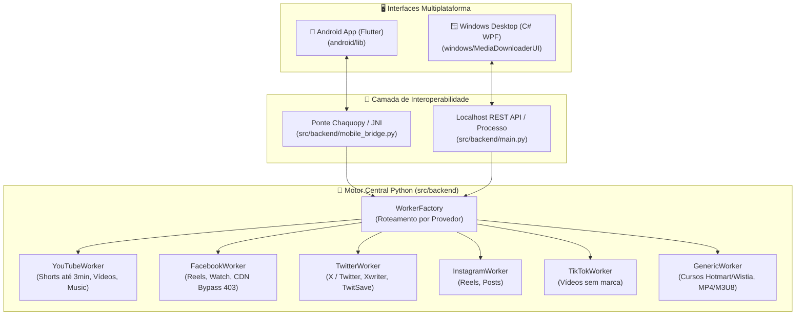

# 📱 MediaDownloader Pro

[](https://github.com/natamaia)
[](https://github.com/natamaia/media_downloader)
[](https://github.com/natamaia/media_downloader)
[-00E676?style=for-the-badge&logo=android&logoColor=white)](https://github.com/natamaia/media_downloader/raw/main/build_apk/MediaDownloader.apk)

**MediaDownloader Pro** é uma solução profissional e multiplataforma para download e extração de áudio e vídeo de múltiplos provedores (YouTube, YouTube Shorts, YouTube Music, Facebook Reels & Vídeos, X/Twitter, Instagram, TikTok, Spotify, Deezer e plataformas de aulas/cursos), estruturada com diretórios independentes para **Android** e **Windows**, compartilhando o mesmo núcleo analítico em **Python (`yt-dlp`)**.

---

## 🗂️ Organização das Plataformas

O repositório é modularizado em diretórios dedicados por plataforma:

*   📱 [**`android/`**](file:///home/natanael/Modelos/media_downloader/android): Aplicativo mobile nativo desenvolvido em **Flutter (Dart)** com tema escuro e verde neon, Material 3, gerenciamento reativo leve em memória, serviço foreground e motor de extração embutido via Chaquopy / Python.
*   🪟 [**`windows/`**](file:///home/natanael/Modelos/media_downloader/windows): Aplicativo desktop para **Windows 10/11** desenvolvido em **C# WPF (.NET 10)** com instalador executável Inno Setup e integração automática com o backend local.
*   📦 [**`build_apk/`**](file:///home/natanael/Modelos/media_downloader/build_apk): Armazena diretamente o binário [**`MediaDownloader.apk`**](file:///home/natanael/Modelos/media_downloader/build_apk/MediaDownloader.apk) (51 MB) compilado e pronto para sideloading em qualquer smartphone Android sem necessidade de ativar Modo Desenvolvedor.
*   🐍 [**`src/backend/`**](file:///home/natanael/Modelos/media_downloader/src/backend): Núcleo compartilhado em **Python**, com arquitetura de workers dedicados por plataforma (`YouTubeWorker`, `FacebookWorker`, `TwitterWorker`, `InstagramWorker`, `TikTokWorker`, `GenericWorker`) e despacho dinâmico via `WorkerFactory`.

---

## 1. 🏗️ Arquitetura do Sistema



---

## 2. 🌟 Recursos Principais

- **Arquitetura Dedicada por Plataforma**: Diretórios isolados para Windows e Android, permitindo desenvolvimento, compilação e empacotamento independentes.
- **Workers Especializados**: Cada plataforma de vídeo possui um worker Python dedicado com tratamentos de URLs, resoluções de redirects (ex: `/share/r/` do Facebook) e fallbacks adequados.
- **APK Pronto para Instalação**: O executável compilado fica versionado e disponível em [`build_apk/MediaDownloader.apk`](file:///home/natanael/Modelos/media_downloader/build_apk/MediaDownloader.apk) para download imediato.
- **Instalação Sem Modo Desenvolvedor**: Basta transferir o `.apk` e instalar no celular permitindo fontes desconhecidas (veja o [Guia em `build_apk/README.md`](file:///home/natanael/Modelos/media_downloader/build_apk/README.md)).
- **Diagnóstico e Cópia de Erro**: Botão dedicado no app mobile para copiar detalhes do erro em caso de falha de download com um único toque.

---

## 3. 📂 Estrutura do Repositório

```text
media_downloader/
├── android/                         # 📱 Aplicativo Mobile Android (Flutter)
│   ├── android/                     # Camada nativa Android (Gradle / Kotlin)
│   ├── lib/                         # Interface Material 3 e State Management (Dart)
│   ├── test/                        # Testes unitários do Flutter (11 testes)
│   ├── pubspec.yaml                 # Dependências do Flutter
│   └── README.md
├── windows/                         # 🪟 Aplicativo Desktop Windows
│   ├── MediaDownloaderUI/           # Interface gráfica desktop C# WPF (.NET 10)
│   ├── installer/                   # Scripts Inno Setup (setup.iss, app_icon.ico)
│   ├── build_installer.ps1          # Automação de compilação do instalador Windows
│   ├── MediaDownloaderBackend.spec  # Spec do PyInstaller
│   └── README.md                    # Instruções de compilação Windows
├── build_apk/                       # 📦 Diretório de Saída do APK
│   ├── README.md                    # Instruções de instalação no smartphone
│   └── MediaDownloader.apk          # Binário APK Release (51MB)
├── src/
│   └── backend/                     # 🐍 Motor compartilhado Python
│       ├── workers/                 # Workers modulares por plataforma
│       ├── config.py                # Configurações de diretórios e concorrência
│       ├── extractor.py             # Extração oEmbed e metadados yt-dlp
│       ├── mobile_bridge.py         # Ponte direta em memória para o Android
│       ├── models.py                # Modelos de dados e enums de estado
│       ├── orchestrator.py          # Gerenciamento de múltiplos downloads
│       └── worker.py                # Interface de despacho com WorkerFactory
├── tests/                           # 🧪 Testes unitários do backend (Pytest 15 testes)
├── docs/                            # 📚 Documentação técnica e arquitetural
├── Makefile                         # ⚙️ Automação (make apk, make test, make test-all)
├── requirements.txt                 # Dependências Python
└── README.md                        # Visão geral do projeto
```

---

## 4. 🛠️ Comandos de Desenvolvimento

```bash
# Visualizar todos os comandos disponíveis
make help

# Compilar o APK Release do Android e mover para build_apk/
make apk

# Executar todos os testes automatizados (Python backend + Flutter Android)
make test-all

# Executar apenas testes do Python
make test

# Executar apenas testes do Flutter
make test-flutter
```

---

## 5. 📚 Documentação Técnica Adicional

Consulte a pasta [`docs/`](file:///home/natanael/Modelos/media_downloader/docs) para guias técnicos detalhados:

*   [**Arquitetura Mobile**](file:///home/natanael/Modelos/media_downloader/docs/ARCHITECTURE_MOBILE.md)
*   [**Integração Python & Chaquopy**](file:///home/natanael/Modelos/media_downloader/docs/ANDROID_PYTHON_INTEGRATION.md)
*   [**Permissões e Scoped Storage**](file:///home/natanael/Modelos/media_downloader/docs/PERMISSIONS_AND_STORAGE_GUIDE.md)
*   [**Guia de Build e Sideloading**](file:///home/natanael/Modelos/media_downloader/docs/BUILD_AND_INSTALL_GUIDE.md)

---

## 👤 Autor & Repositório Oficial

*   **Autor**: [@natamaia](https://github.com/natamaia)
*   **Repositório Oficial**: [github.com/natamaia/media_downloader](https://github.com/natamaia/media_downloader)
*   **Licença**: MIT
