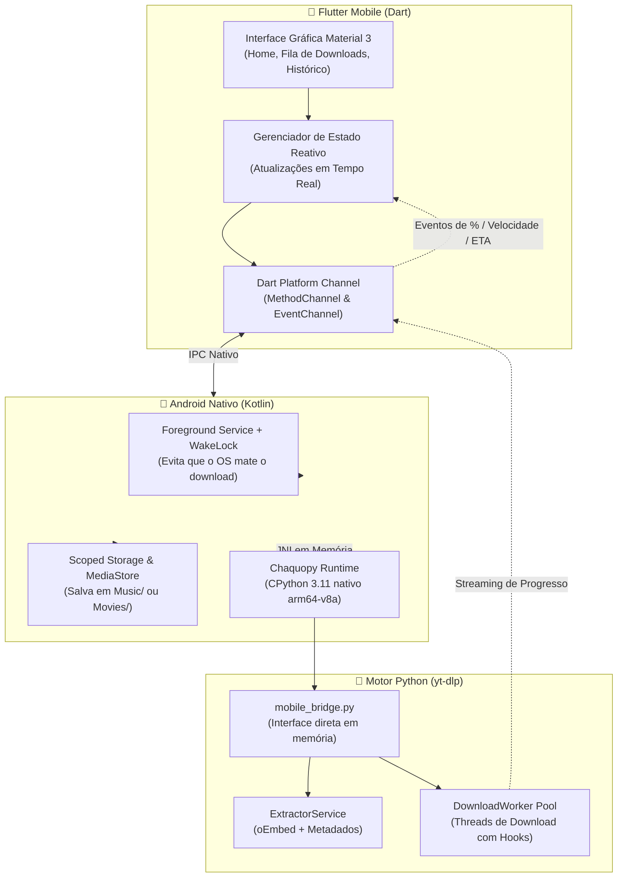

# 📱 MediaDownloader Pro

[](https://github.com/natamaia)
[](https://github.com/natamaia/media_downloader)
[](https://github.com/natamaia/media_downloader)

**MediaDownloader Pro** é uma solução moderna e multiplataforma para download e extração de áudio e vídeo de múltiplos provedores (YouTube, YouTube Shorts, YouTube Music, Spotify, Deezer, TikTok, Instagram, Vimeo e centenas de outros), com foco prioritário em **dispositivos móveis Android via Flutter + Python Embarcado** e distribuição independente em formato **APK (Sideloading)**.

> [!NOTE]
> **Evolução da Stack**: A interface legada em C# WPF (.NET 10) foi descontinuada e removida. A nova arquitetura mobile utiliza **Flutter** para uma interface fluida a 60/120 FPS com Material 3, gerenciamento reativo e mantém o motor analítico em **Python (`yt-dlp`)** embarcado diretamente no APK Android.

---

## 1. 🏗️ Arquitetura do Sistema Mobile



---

## 2. 🌟 Recursos Principais

- **Motor Universal em Python (`yt-dlp`) & Downloader Direto**: Suporte a dezenas de provedores (YouTube, Shorts até 3min, YouTube Music, X/Twitter, Xwriter, Telegram, Spotify, Deezer, TikTok, Instagram, Vimeo, plataformas de aulas como Hotmart, Wistia, Loom e arquivos diretos `.mp4`, `.m3u8`, `.mp3`).
- **Interface Mobile Nativa em Flutter**: Design moderno Material 3, cartões animados, progresso suave em tempo real (MB/s, ETA, %) e botão integrado para **Copiar Erro** e diagnóstico rápido.
- **Gerenciamento Reativo em Memória**: Fila e histórico leves e fluidos, eliminando bloqueios de transação de banco de dados e otimizando o consumo de bateria e memória no aparelho.
- **Sem Necessidade de Servidores Remotos**: O motor Python executa em processo local dentro do próprio APK, sem depender de nuvens externas, VPS ou portas abertas.
- **Foreground Service Android**: Downloads não pausam quando o usuário minimiza o app ou a tela do aparelho se apaga.
- **Instalação Direta Sem Modo Desenvolvedor**: O binário APK compilado fica disponível na pasta raiz `build_apk/MediaDownloader.apk` pronto para transferência e instalação simples.

---

## 3. 📚 Documentação Técnica Completa

Para detalhes aprofundados sobre cada camada do sistema, consulte a documentação dedicada na pasta [`docs/`](file:///home/natanael/Modelos/media_downloader/docs):

| Documento | Descrição |
| :--- | :--- |
| [**Arquitetura do Sistema**](file:///home/natanael/Modelos/media_downloader/docs/ARCHITECTURE_MOBILE.md) | Visão detalhada das camadas Clean Architecture, fluxos de dados e ciclo de vida mobile. |
| [**Integração Python no APK**](file:///home/natanael/Modelos/media_downloader/docs/ANDROID_PYTHON_INTEGRATION.md) | Configuração do Chaquopy, compilação de CPython no Android, bindings JNI e `mobile_bridge.py`. |
| [**Permissões e Armazenamento**](file:///home/natanael/Modelos/media_downloader/docs/PERMISSIONS_AND_STORAGE_GUIDE.md) | Scoped Storage, MediaStore (Músicas e Vídeos), notificações e Foreground Services no Android 14+. |
| [**Guia de Build e Instalação**](file:///home/natanael/Modelos/media_downloader/docs/BUILD_AND_INSTALL_GUIDE.md) | Instruções para gerar o `.apk` e instalar no celular sem ativar o Modo Desenvolvedor. |
| [**Diretório de Saída do APK**](file:///home/natanael/Modelos/media_downloader/build_apk/README.md) | Orientações de transferência e instalação do binário na pasta `build_apk/`. |

---

## 4. 📂 Estrutura do Repositório

```text
media_downloader/
├── build_apk/                       # Pasta de destino do APK final compilado
│   ├── README.md                    # Instruções de instalação no smartphone
│   └── MediaDownloader.apk          # Binário APK para teste no celular (gerado via build)
├── docs/                            # Documentação técnica e arquitetural
│   ├── ARCHITECTURE_MOBILE.md       # Arquitetura geral do app Flutter + Python
│   ├── ANDROID_PYTHON_INTEGRATION.md# Runtime Chaquopy, Gradle e JNI nativo
│   ├── PERMISSIONS_AND_STORAGE_GUIDE.md # Permissões e Scoped Storage no Android
│   └── BUILD_AND_INSTALL_GUIDE.md   # Passo a passo de compilação e sideloading
├── mobile_app/                      # Aplicação Flutter (Interface e Camada de Domínio)
│   ├── android/                     # Projeto nativo Android com integração Chaquopy
│   └── lib/                         # Código Dart (UI Material 3 e State Management)
├── src/
│   ├── backend/                     # Motor compartilhado Python
│   │   ├── config.py                # Configurações de diretórios e concorrência
│   │   ├── extractor.py             # Extração oEmbed e metadados yt-dlp
│   │   ├── mobile_bridge.py         # Ponte direta em memória para o canal nativo Android
│   │   ├── models.py                # Modelos de dados e enums de estado
│   │   ├── orchestrator.py          # Gerenciamento de múltiplos downloads simultâneos
│   │   └── worker.py                # Threads de download assíncrono com hooks de progresso
│   └── frontend_linux/              # (Opcional) Interface desktop Linux em GTK4
├── Makefile                         # Comandos de automação (make apk, make run, make test)
├── requirements.txt                 # Dependências Python
└── README.md                        # Visão geral do projeto
```

---

## 5. 🛠️ Ambiente de Desenvolvimento e Ferramentas

### Pré-requisitos
- **Flutter SDK**: 3.x estável
- **Android SDK**: API 34+ com Build-Tools
- **Java**: JDK 17
- **Python**: 3.10 ou superior

### Comandos Rápidos

```bash
# Visualizar todos os comandos disponíveis
make help

# Compilar o APK Release do Android e mover para build_apk/
make apk

# Executar todos os testes automatizados (Python backend + Flutter mobile)
make test-all
```

---

## 6. 🗺️ Status de Implementação das Fases

1. **Fase 1: Especificação e Documentações de Arquitetura** *(Concluída ✅)*
   - Remoção do C# / WPF.
   - Criação da pasta `build_apk/` para distribuição direta.
   - Elaboração das especificações em `docs/`.
2. **Fase 2: Scaffold do Flutter e Gerenciamento Reativo** *(Concluída ✅)*
   - Criação do projeto `mobile_app` com Flutter.
   - Gerenciamento reativo em memória com StateNotifier e remoção de overhead de SQLite.
3. **Fase 3: Motor Universal Python e Downloader Direto** *(Concluída ✅)*
   - Suporte a YouTube, YouTube Shorts (até 3min), X (Twitter), Xwriter, Telegram, plataformas de aulas e mídias diretas.
   - Streaming direto chunk-by-chunk com cálculo de velocidade e ETA.
4. **Fase 4: Interface de Usuário Material 3 e Botões de Diagnóstico** *(Concluída ✅)*
   - Telas de Início, Fila de Downloads e Histórico.
   - Botão "Copiar Erro" e "Ver Log Técnico" para relatório de falhas simplificado.
5. **Fase 5: Build do APK e Distribuição Sideloading** *(Concluída ✅)*
   - Binário final gerado e disponível em `build_apk/MediaDownloader.apk`.
   - Compatível com instalação direta no celular sem modo desenvolvedor.

---

## 👤 Autor & Repositório Oficial

- **Autor / Desenvolvedor**: [natamaia](https://github.com/natamaia)
- **Repositório Oficial**: [github.com/natamaia/media_downloader](https://github.com/natamaia/media_downloader)
- **Licença**: MIT

