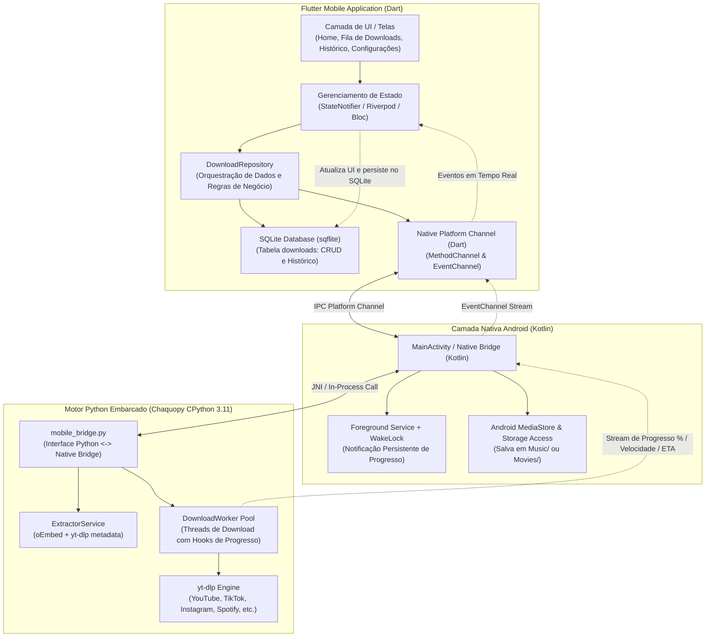

# 🏛️ Arquitetura do Sistema: MediaDownloader Mobile

Este documento descreve a especificação arquitetural da versão Mobile do **MediaDownloader**, desenvolvida com **Flutter (UI e Camada de Apresentação)**, **SQLite (Persistência Local e Histórico)** e **Python CPython Embarcado (Motor yt-dlp para Android APK)**.

---

## 1. Visão Geral e Motivação

O projeto original utilizava uma interface desktop em C# WPF (.NET 10) acoplada a um backend local FastAPI em Python. Para viabilizar a experiência móvel com distribuição via APK independente (sideloading):

1. **Remoção do C# / WPF**: A base legada em C# foi descontinuada.
2. **Adoção do Flutter (Dart)**: Proporciona uma interface nativa de alto desempenho (60/120 FPS), visual Material 3 responsivo para smartphones e tablets, suporte robusto a temas Claro/Escuro e gerenciamento de estado reativo.
3. **Persistência com SQLite (`sqflite`)**: Grava de forma segura e offline todos os downloads concluídos, downloads em andamento, URLs, títulos, tamanhos, miniaturas e estados de erro, permitindo retomada e histórico permanente.
4. **Motor Python Nativo Embarcado no APK (Chaquopy)**: O motor de extração e download baseado em `yt-dlp` é empacotado diretamente dentro do binário APK via runtime CPython nativo para Android (arquiteturas `arm64-v8a` e `armeabi-v7a`), executando localmente sem a necessidade de servidores remotos externos.

---

## 2. Diagrama da Arquitetura do Sistema



---

## 3. Camadas da Aplicação Flutter (Clean Architecture)

A estrutura do projeto Flutter adota os princípios de Clean Architecture e separação de responsabilidades:

```text
mobile_app/
├── android/                         # Configuração nativa Android (Gradle, Manifest, Chaquopy)
│   ├── app/
│   │   ├── build.gradle             # Plugin Chaquopy, dependências nativas e ABI filters
│   │   └── src/main/
│   │       ├── AndroidManifest.xml  # Permissões (INTERNET, FOREGROUND_SERVICE, STORAGE)
│   │       └── kotlin/              # Bridge JNI Chaquopy e Foreground Service
├── lib/
│   ├── core/                        # Utilitários, constantes, tema Material 3, rotas
│   │   ├── constants/               # Strings, endpoints, chaves de canal
│   │   ├── database/                # Inicialização e migrations do SQLite (sqflite)
│   │   ├── theme/                   # Paleta Dark/Light com cores de destaque
│   │   └── utils/                   # Formatadores de bytes, tempo e URLs
│   ├── data/
│   │   ├── datasources/
│   │   │   ├── download_local_datasource.dart  # Consultas SQL diretas
│   │   │   └── python_native_datasource.dart   # Comunicação via MethodChannel/EventChannel
│   │   ├── models/                  # Modelos serializáveis JSON / Map para SQLite
│   │   └── repositories/            # Implementação de DownloadRepository
│   ├── domain/
│   │   ├── entities/                # Entidades puras (DownloadTask, VideoMetadata)
│   │   └── repositories/            # Contratos de repositório
│   └── presentation/
│       ├── controllers/             # Gerenciamento de estado (Riverpod/Bloc)
│       ├── screens/                 # Telas (Home, Downloads, Settings)
│       └── widgets/                 # Componentes reutilizáveis (Input, Preview, Card, Progresso)
```

---

## 4. Integração Nativa e Ciclo de Vida Android

### 4.1. Processamento em Background e Prevenção do Low Memory Killer (LMK)
Downloads móveis podem levar minutos e consumir megabytes consideráveis. O sistema operacional Android suspende ou mata processos em segundo plano para economizar bateria se eles não estiverem declarados adequadamente:
- **Foreground Service**: Ao iniciar um ou mais downloads, um `ForegroundService` nativo do Android é ativado, exibindo uma notificação fixa na barra de status com progresso dinâmico e botão de cancelamento.
- **WakeLock Parcial (`PARTIAL_WAKE_LOCK`)**: Garante que o processador continue operando mesmo com a tela apagada.
- **Tipos de Serviço Android 14+**: Declaração explícita de `android:foregroundServiceType="dataSync"` no `AndroidManifest.xml`.

### 4.2. Fluxo de Execução de um Download

1. **Entrada do Link**: O usuário cola uma URL na tela principal do Flutter.
2. **Extração de Metadados**: O Flutter solicita os metadados via `MethodChannel`. O módulo nativo invoca o `ExtractorService` em Python. Os metadados (título, autor, miniatura, qualidades disponíveis) retornam ao Flutter e são renderizados na interface em um card de visualização.
3. **Início do Download**: O usuário seleciona o formato (MP4 ou MP3) e clica em Baixar.
4. **Registro no SQLite**: O Flutter cria um registro inicial na tabela `downloads` com status `EXTRACTING` ou `DOWNLOADING`.
5. **Execução no Worker Python**: O comando é repassado ao `DownloadWorker` em thread separada dentro do runtime CPython.
6. **Streaming de Progresso**: O hook de progresso do `yt-dlp` dispara eventos contínuos (porcentagem, velocidade em MB/s, ETA em segundos e bytes baixados). O canal de eventos (`EventChannel`) transmite esses dados para a UI do Flutter, que atualiza a barra de progresso suavemente e grava checkpoints no SQLite.
7. **Finalização e Indexação de Mídia**: O arquivo é movido para o diretório público de Músicas (`Music`) ou Vídeos (`Movies`) e indexado via `MediaScannerConnection` para aparecer imediatamente no player e na galeria do usuário.
8. **Atualização do SQLite**: O registro do banco é atualizado para status `COMPLETED`, com o caminho final do arquivo salvo.

---

## 5. Diretório de Saída do APK (`build_apk`)

Para que o desenvolvedor e o usuário possam testar a aplicação em dispositivos físicos sem ferramentas de desenvolvedor (ADB):
- O script de automação (`scripts/build_apk.sh` ou `make apk`) compila o APK de release universal (`app-release.apk`) e o move diretamente para o diretório raiz `/build_apk/MediaDownloader.apk`.
- O usuário apenas copia o arquivo para o smartphone (via cabo USB, mensageiro ou nuvem) e executa o instalador diretamente no aparelho.
