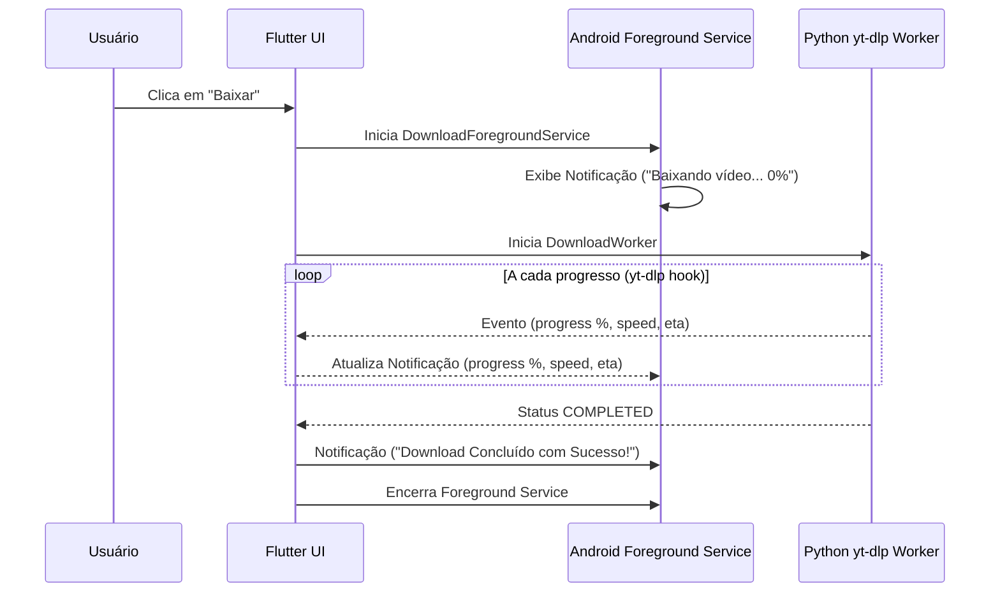

# 🛡️ Guia de Permissões, Armazenamento e Serviços Nativos do Android

Este documento detalha o gerenciamento de permissões do sistema Android, a arquitetura de armazenamento com **Scoped Storage / MediaStore** e a execução de **Foreground Services** com notificações interativas para o **MediaDownloader Mobile**.

---

## 1. Permissões no `AndroidManifest.xml`

Para que o aplicativo realize downloads contínuos, salve arquivos acessíveis na galeria e continue operando com a tela do smartphone apagada, as seguintes permissões devem ser declaradas:

```xml
<manifest xmlns:android="http://schemas.android.com/apk/res/android">

    <!-- Conectividade de Rede -->
    <uses-permission android:name="android.permission.INTERNET" />
    <uses-permission android:name="android.permission.ACCESS_NETWORK_STATE" />

    <!-- Notificações no Android 13+ (API 33+) -->
    <uses-permission android:name="android.permission.POST_NOTIFICATIONS" />

    <!-- Execução em Segundo Plano & Prevenção de Suspensão -->
    <uses-permission android:name="android.permission.WAKE_LOCK" />
    <uses-permission android:name="android.permission.FOREGROUND_SERVICE" />
    <uses-permission android:name="android.permission.FOREGROUND_SERVICE_DATA_SYNC" />

    <!-- Compatibilidade com armazenamento legado (Android 9 ou inferior) -->
    <uses-permission android:name="android.permission.READ_EXTERNAL_STORAGE" android:maxSdkVersion="32" />
    <uses-permission android:name="android.permission.WRITE_EXTERNAL_STORAGE" android:maxSdkVersion="29" />

    <application
        android:label="MediaDownloader"
        android:name="${applicationName}"
        android:icon="@mipmap/ic_launcher"
        android:requestLegacyExternalStorage="true">

        <!-- Declaração do Serviço em Primeiro Plano -->
        <service
            android:name=".DownloadForegroundService"
            android:foregroundServiceType="dataSync"
            android:exported="false" />

        <activity
            android:name=".MainActivity"
            android:exported="true"
            android:launchMode="singleTop"
            android:theme="@style/LaunchTheme"
            android:configChanges="orientation|keyboardHidden|keyboard|screenSize|smallestScreenSize|locale|layoutDirection|fontScale|screenLayout|density|uiMode"
            android:hardwareAccelerated="true"
            android:windowSoftInputMode="adjustResize">
            
            <intent-filter>
                <action android:name="android.intent.action.MAIN"/>
                <category android:name="android.intent.category.LAUNCHER"/>
            </intent-filter>

            <!-- Receptor de Compartilhamento (Receber links via botão 'Compartilhar' de outros apps) -->
            <intent-filter>
                <action android:name="android.intent.action.SEND" />
                <category android:name="android.intent.category.DEFAULT" />
                <data android:mimeType="text/plain" />
            </intent-filter>
        </activity>
    </application>
</manifest>
```

---

## 2. Armazenamento e Scoped Storage (Android 10 até Android 15)

### 2.1. O Desafio do Scoped Storage
A partir do Android 10 (API 29) e reforçado no Android 11+ (API 30+), o Android impede que aplicativos gravem livremente caminhos absolutos como `/sdcard/` ou `/storage/emulated/0/` sem permissões administrativas invasivas.

### 2.2. A Solução Nativa Recomendada: MediaStore & Diretórios Públicos
Para evitar pedir permissões excessivas (como `MANAGE_EXTERNAL_STORAGE`) que assustam o usuário, o app adota o padrão oficial do Google:
1. **Download Inicial no Cache do App**: O motor Python baixa os chunks e partes temporárias em `context.cacheDir` ou `context.getExternalFilesDir(null)`. Nenhuma permissão especial é necessária para essa pasta.
2. **Transferência para a Coleção Pública de Mídia**: Ao finalizar o download e a conversão:
   - Se for áudio/música (**MP3**): Gravado na pasta pública `Music/MediaDownloader/` via API `MediaStore.Audio.Media.EXTERNAL_CONTENT_URI`.
   - Se for vídeo (**MP4**): Gravado na pasta pública `Movies/MediaDownloader/` via API `MediaStore.Video.Media.EXTERNAL_CONTENT_URI`.
   - Alternativa simples via diretório público de Downloads: Utiliza o diretório nativo `Environment.getExternalStoragePublicDirectory(Environment.DIRECTORY_DOWNLOADS)`.
3. **Escaneamento Imediato de Mídia (`MediaScannerConnection`)**:
   Assim que o arquivo é gravado, o método `MediaScannerConnection.scanFile()` é disparado para que a música ou vídeo apareça instantaneamente no reprodutor de música, no VLC e na Galeria do celular, sem precisar reiniciar o aparelho.

---

## 3. Notificação e Foreground Service

### 3.1. Por que o Foreground Service é Indispensável?
Quando o usuário sai do app para usar o WhatsApp, o Instagram ou bloqueia a tela, o sistema Android rapidamente coloca a aplicação em estado de hibernação (*Doze Mode*). O Foreground Service com uma notificação persistente na barra de status garante:
- **Prioridade Máxima no Agendador do Sistema**: A CPU do smartphone não mata o processo do download.
- **Transparência para o Usuário**: A notificação exibe:
  - Título do vídeo/áudio sendo baixado.
  - Barra de progresso com porcentagem em tempo real.
  - Velocidade atual (ex: `3.8 MB/s`) e tempo estimado restante (`ETA: 00:45`).
  - Botão de ação direta: **Cancelar Download**.


